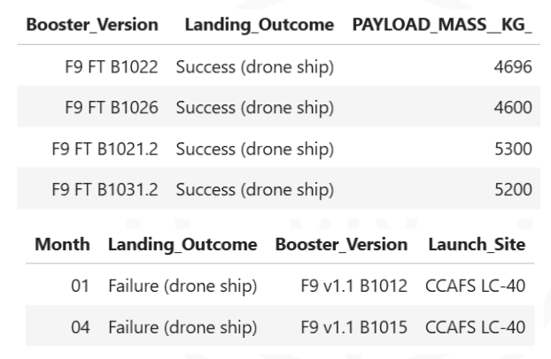
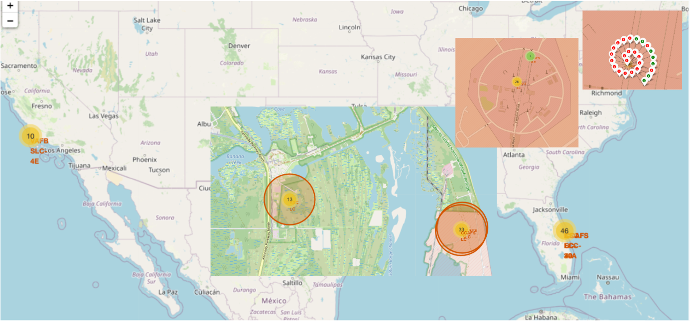
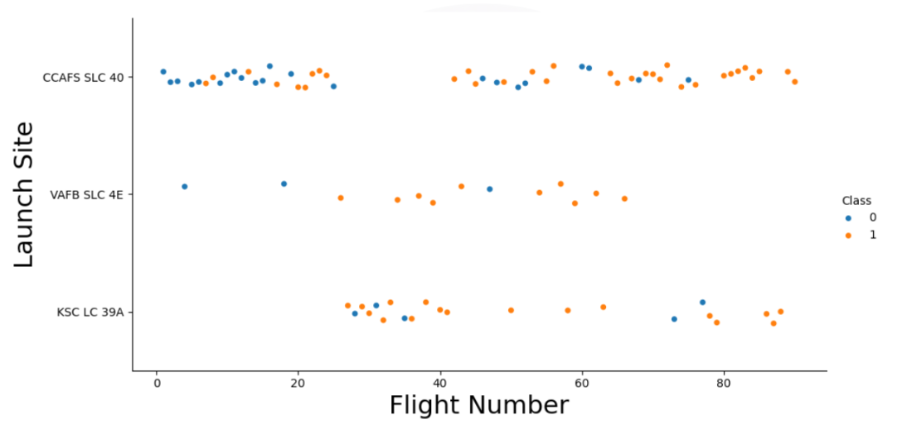
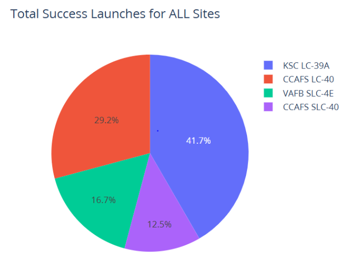
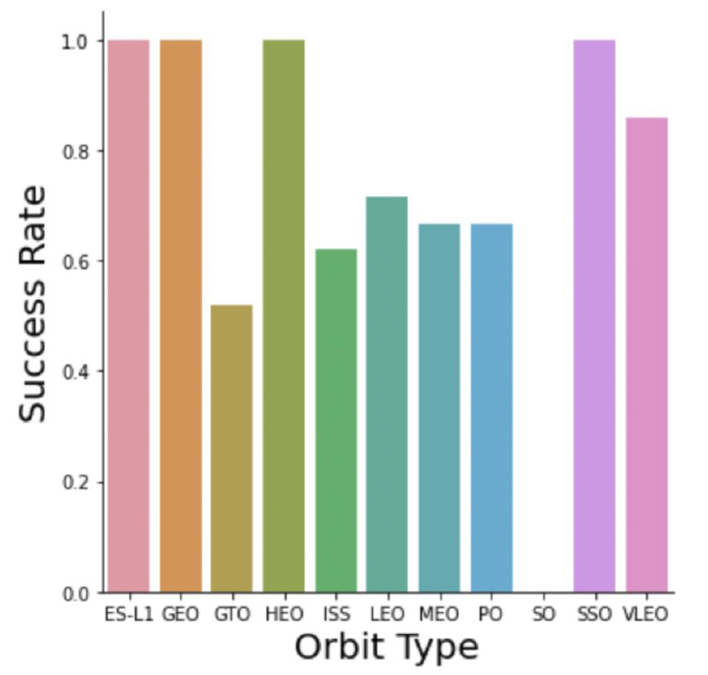
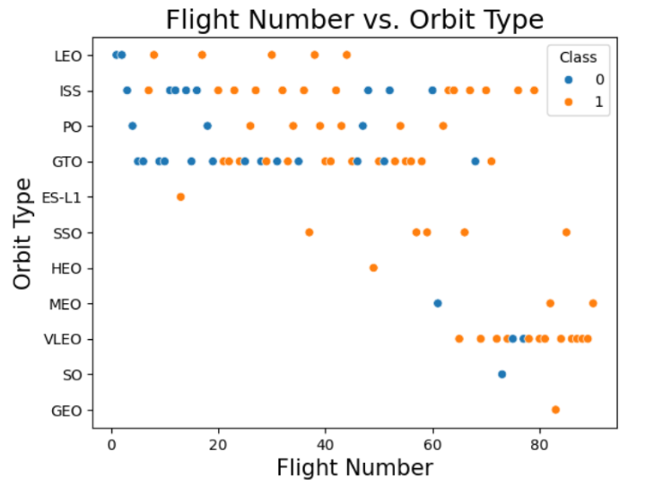
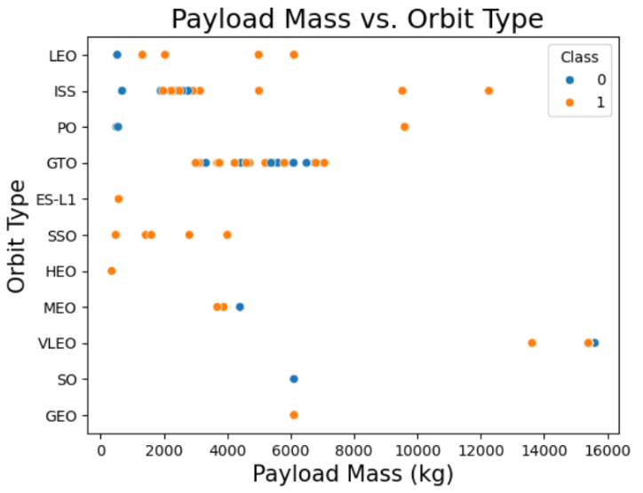
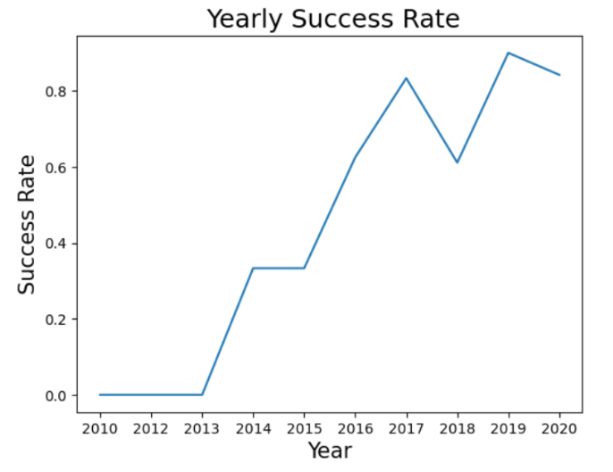
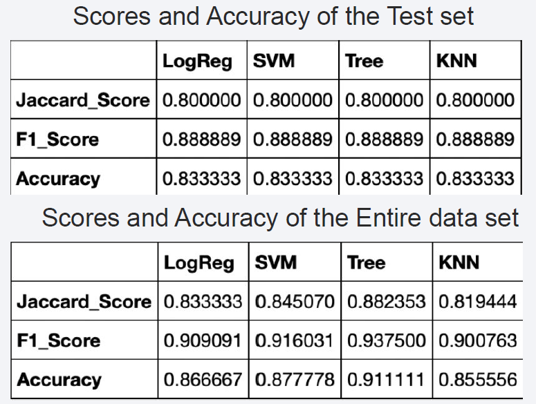
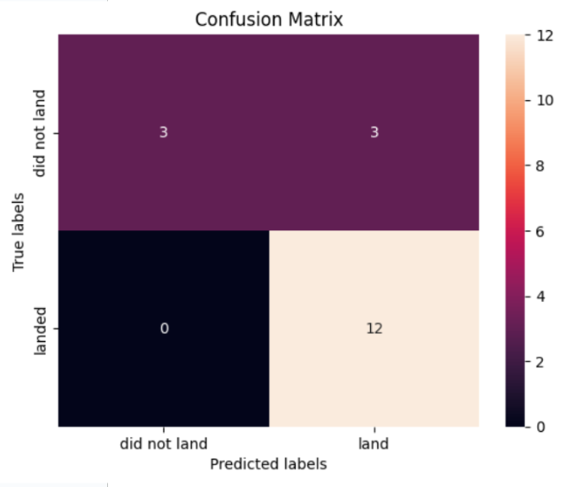

# Data Science Portfolio
This portfolio contains the tasks I accomplished for the data science certificate course, including all Jupyter Notebooks and Python code for interactive dashboards and a case study.

# Project: Rocket First Stage Landing Prediction
## Introduction
### Context
SpaceX has emerged as a leader in the commercial space industry, revolutionizing space travel
by significantly reducing costs. The company offers Falcon 9 rocket launches at a competitive
price of 62 million dollars, compared to over 165 million dollars charged by other providers. A
key factor in these savings is the reusability of the Falcon 9’s first stage. Accurately predicting
whether the first stage will successfully land is crucial for estimating launch costs and enhancing
reusability strategies. By utilizing public data and machine learning models, this project aims to
forecast the likelihood of successful landings of SpaceX's Falcon 9 first stage.

### Questions to address
* How do factors like payload mass, launch site, flight count, and orbital parameters influence the
success rate of first stage landings?
* Has there been an improvement in the success rate of landings over time?
* Which machine learning algorithm performs best for predicting the binary outcome of landing
success in this context?

## Methodology 
* Data collection:
  - Using SpaceX Rest API
  - Using Web Scraping from Wikipedia
* Data wrangling
  - Clean up the data
  - Dealing with missing values
  - Using One Hot Encoding to prepare the data to a binary classification
* Exploratory data analysis (EDA) using visualization and SQL
* Data visualization using Folium and Plotly Dash
* Construct classification models
* Evaluate model performance

## Results 
* Exploratory data analysis (EDA)
* Data visualization and interacitve analytics demo
* Predictive resutls
* Prediction evaluation with scoring matrix

 
### Exploratory data analysis (EDA)

**EDA with SQL results**

 

### Data visualization and interacitve analytics demo
**Launch site locations and success rate**

**Success launch vs. Launch Site**

    

**Success launch vs. Orbit Types**

  

**Yearly Trend of Success launch**

**Model accuracy**

 &nbsp;&nbsp;&nbsp;&nbsp; 

## Conclusion 
* The Decision Tree Model proved to be the most effective algorithm for predicting landing success with this dataset.
* Launches with lower payload mass tend to have higher success rates compared to those with heavier payloads.
* The majority of launch sites are strategically located near the equator and in close proximity to coastlines, optimizing launch efficiency.
* The success rate of launches has improved consistently over time, indicating advancements in technology and processes.
* Among all the launch sites, KSC LC-39A demonstrated the highest success rate, making it the most reliable site.
* Certain orbits, such as ES-L1, GEO, HEO, and SSO, achieved a 100% success rate, suggesting their suitability for specific mission profiles.

